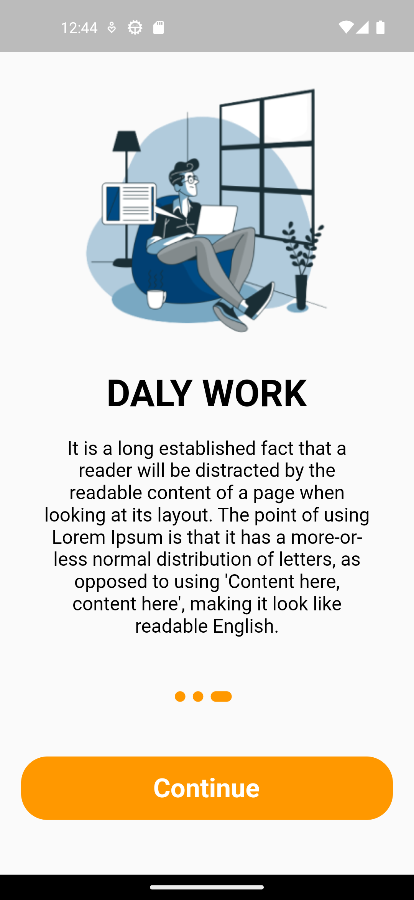
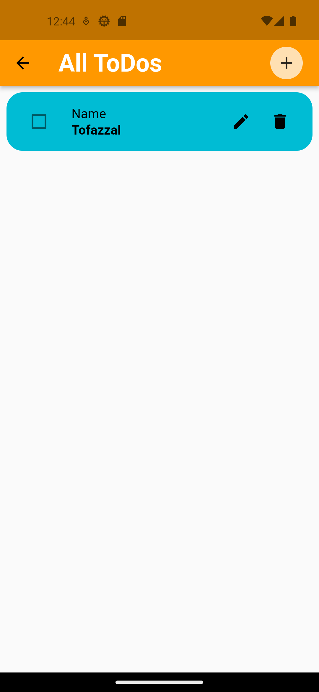
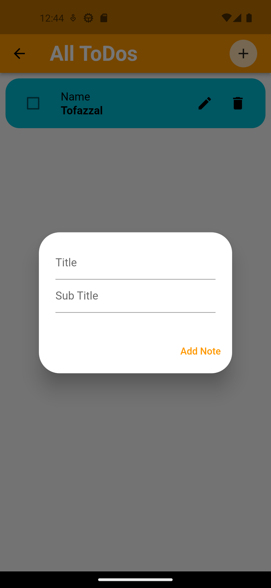
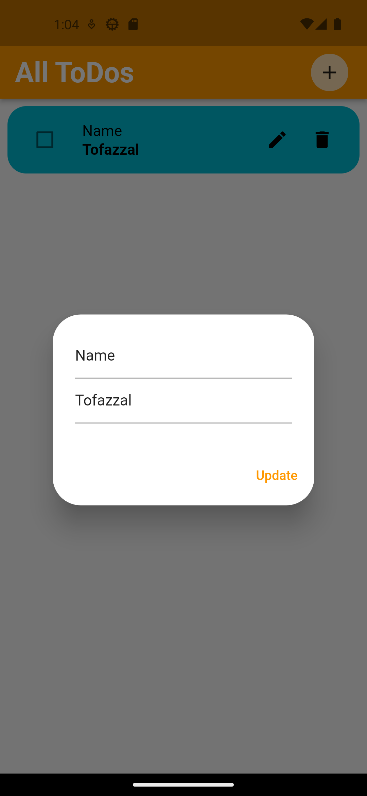
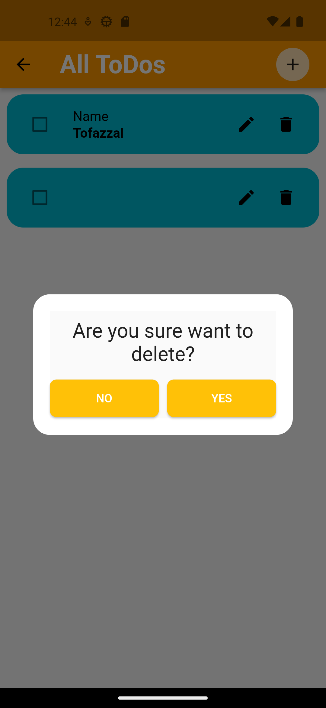

# Todo Application

Users can save and select their important information for later modification and cancellation.

## Screenshots

<p align="center">
  
  
  
</p>
<p align="center">
  
  
  
</p>
<p align="center">
  
</p>


## Features

- On_Boarding Pages
- Any time note Added, modification and cancellation


## Setup

Clone the repository

```bash
  git clone https://github.com/Tofazzal-2443/todo_list_application.git
```
Move to the desired folder

```bash
  cd \todo_list_application
```
To run the app, simply write

```bash
  flutter pub get
```
```bash
  flutter run
```
## Tech Stack

**Built With:** Dart, Flutter

**State Management:** GetX

**Backend:** Firebase


## Platform

- Android


## Support

For support, please contact here [](https://www.linkedin.com/in/tofazzal15)
